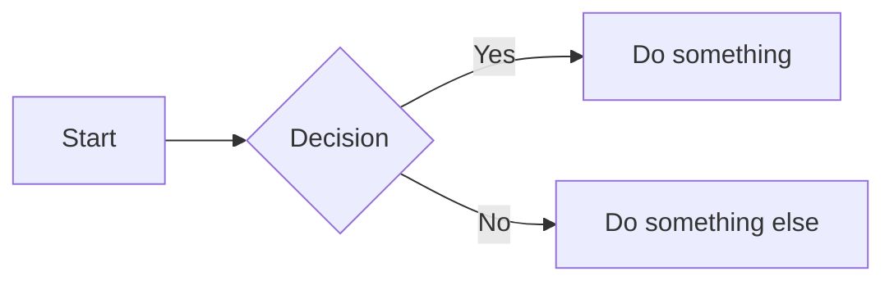

This is a test post with **bold**, *italic*, and `inline code`.

## Code Block

```python
def hello():
    """Greet the world."""
    print("Hello, world!")

hello()
```

## Mermaid Diagram



## Lists

- Item one
- Item two
- Item three

> A blockquote for good measure.
