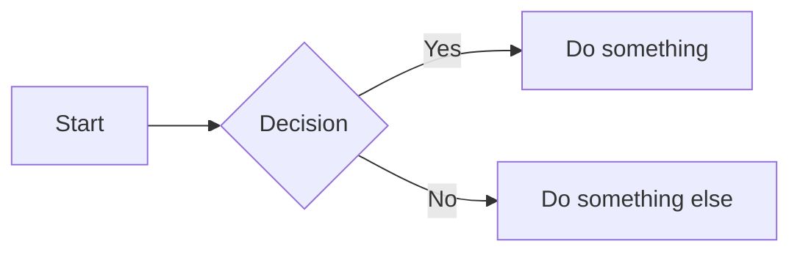

# enumerator-dev Hugo Theme Implementation Plan

> **For Claude:** REQUIRED SUB-SKILL: Use superpowers:executing-plans to implement this plan task-by-task.

**Goal:** Build a fully compliant Hugo theme that reproduces the enumerator.dev Ghost theme's design using Hugo conventions, Tailwind CSS v4, daisyUI v5, and Chroma syntax highlighting.

**Architecture:** Hugo theme at `themes/enumerator-dev/` using `css.TailwindCSS` Hugo Pipe for CSS compilation, Go templates for layouts, and Hugo's built-in features for pagination, taxonomies, RSS, and syntax highlighting. No external JS dependencies except Mermaid CDN for diagrams.

**Tech Stack:** Hugo (extended v0.154.5), Tailwind CSS v4, daisyUI v5, @tailwindcss/typography, Chroma (syntax highlighting), Mermaid (CDN)

**Reference theme:** `/Users/cassidy/code/enumerator-dev-theme/` (Ghost/Handlebars)

---

### Task 1: Scaffold Theme Directory and Configuration

**Files:**
- Create: `themes/enumerator-dev/theme.toml`
- Create: `hugo.toml` (site-level config)
- Create: `themes/enumerator-dev/package.json`

**Step 1: Create theme directory structure**

```bash
mkdir -p themes/enumerator-dev/{layouts/{_default,page,partials,taxonomy},assets/{css,js},static/fonts}
```

**Step 2: Create `themes/enumerator-dev/theme.toml`**

```toml
name = "enumerator-dev"
license = "MIT"
licenselink = "https://github.com/yourusername/enumerator-dev-theme/blob/main/LICENSE"
description = "A clean dev blog theme with Catppuccin colors, Tailwind CSS, and daisyUI"
tags = ["blog", "tailwind", "daisyui", "catppuccin", "dark-mode"]
min_version = "0.128.0"

[author]
  name = "cassiopod"
```

**Step 3: Create site-level `hugo.toml`**

```toml
baseURL = 'https://enumerator.dev/'
languageCode = 'en-us'
title = 'enumerator.dev'
theme = 'enumerator-dev'
paginate = 10

[taxonomies]
  tag = 'tags'

[markup]
  [markup.highlight]
    noClasses = false
    lineNos = false
    guessSyntax = true

[outputs]
  home = ['html', 'rss']
  section = ['html', 'rss']
  taxonomy = ['html', 'rss']

[build]
  [build.buildStats]
    enable = true
  [[build.cachebusters]]
    source = 'assets/notwatching/hugo_stats\.json'
    target = 'css'
  [[build.cachebusters]]
    source = '(postcss|tailwind)\.config\.js'
    target = 'css'

[module]
  [[module.mounts]]
    source = 'assets'
    target = 'assets'
  [[module.mounts]]
    source = 'hugo_stats.json'
    target = 'assets/notwatching/hugo_stats.json'
    disableWatch = true

[menus]
  [[menus.main]]
    name = 'About'
    url = '/about/'
    weight = 10
  [[menus.footer]]
    name = 'RSS'
    url = '/index.xml'
    weight = 10
```

**Step 4: Create `themes/enumerator-dev/package.json`**

```json
{
  "name": "enumerator-dev-theme",
  "version": "0.1.0",
  "private": true,
  "devDependencies": {
    "@tailwindcss/cli": "^4.2.0",
    "@tailwindcss/typography": "^0.5.19",
    "daisyui": "^5.5.18",
    "tailwindcss": "^4.2.0"
  }
}
```

**Step 5: Install npm dependencies**

```bash
cd themes/enumerator-dev && npm install && cd ../..
```

**Step 6: Commit**

```bash
git add themes/enumerator-dev/theme.toml themes/enumerator-dev/package.json themes/enumerator-dev/package-lock.json hugo.toml
git commit -m "Scaffold Hugo theme directory and configuration"
```

---

### Task 2: CSS Source and Font Assets

**Files:**
- Create: `themes/enumerator-dev/assets/css/main.css`
- Copy: Font files from Ghost theme to `themes/enumerator-dev/static/fonts/`

**Step 1: Copy font files**

```bash
cp /Users/cassidy/code/enumerator-dev-theme/assets/fonts/*.woff2 themes/enumerator-dev/static/fonts/
```

**Step 2: Create `themes/enumerator-dev/assets/css/main.css`**

This is the Tailwind v4 source file. It mirrors the Ghost theme's `src/css/index.css` but replaces Prism.js token styles with Chroma classes, and adjusts font paths for Hugo's static directory.

```css
@import "tailwindcss";
@source "hugo_stats.json";
@plugin "@tailwindcss/typography";
@plugin "daisyui";

@font-face {
  font-family: 'Source Serif 4';
  src: url('/fonts/SourceSerif4Variable-Roman.ttf.woff2') format('woff2');
  font-weight: 200 900;
  font-style: normal;
  font-display: swap;
}

@font-face {
  font-family: 'Source Serif 4';
  src: url('/fonts/SourceSerif4Variable-Italic.ttf.woff2') format('woff2');
  font-weight: 200 900;
  font-style: italic;
  font-display: swap;
}

@font-face {
  font-family: 'Source Sans 3';
  src: url('/fonts/SourceSans3VF-Upright.ttf.woff2') format('woff2');
  font-weight: 200 900;
  font-style: normal;
  font-display: swap;
}

@font-face {
  font-family: 'Source Sans 3';
  src: url('/fonts/SourceSans3VF-Italic.ttf.woff2') format('woff2');
  font-weight: 200 900;
  font-style: italic;
  font-display: swap;
}

@font-face {
  font-family: 'Source Code Pro';
  src: url('/fonts/SourceCodeVF-Upright.ttf.woff2') format('woff2');
  font-weight: 200 900;
  font-style: normal;
  font-display: swap;
}

@font-face {
  font-family: 'Source Code Pro';
  src: url('/fonts/SourceCodeVF-Italic.ttf.woff2') format('woff2');
  font-weight: 200 900;
  font-style: italic;
  font-display: swap;
}

html {
  font-size: 18px;
}

@plugin "daisyui/theme" {
  name: "catppuccin-latte";
  default: true;
  prefersdark: false;
  color-scheme: light;

  --color-base-100: #eff1f5;
  --color-base-200: #e6e9ef;
  --color-base-300: #dce0e8;
  --color-base-content: #4c4f69;
  --color-primary: #8839ef;
  --color-primary-content: #eff1f5;
  --color-secondary: #1e66f5;
  --color-secondary-content: #eff1f5;
  --color-accent: #ea76cb;
  --color-accent-content: #eff1f5;
  --color-neutral: #ccd0da;
  --color-neutral-content: #4c4f69;
  --color-info: #209fb5;
  --color-info-content: #eff1f5;
  --color-success: #40a02b;
  --color-success-content: #eff1f5;
  --color-warning: #df8e1d;
  --color-warning-content: #eff1f5;
  --color-error: #d20f39;
  --color-error-content: #eff1f5;
}

@plugin "daisyui/theme" {
  name: "catppuccin-mocha";
  default: false;
  prefersdark: true;
  color-scheme: dark;

  --color-base-100: #1e1e2e;
  --color-base-200: #181825;
  --color-base-300: #11111b;
  --color-base-content: #cdd6f4;
  --color-primary: #cba6f7;
  --color-primary-content: #1e1e2e;
  --color-secondary: #89b4fa;
  --color-secondary-content: #1e1e2e;
  --color-accent: #f5c2e7;
  --color-accent-content: #1e1e2e;
  --color-neutral: #313244;
  --color-neutral-content: #cdd6f4;
  --color-info: #74c7ec;
  --color-info-content: #1e1e2e;
  --color-success: #a6e3a1;
  --color-success-content: #1e1e2e;
  --color-warning: #f9e2af;
  --color-warning-content: #1e1e2e;
  --color-error: #f38ba8;
  --color-error-content: #1e1e2e;
}

body {
  font-family: 'Source Sans 3', 'Helvetica Neue', Helvetica, Arial, sans-serif;
}

h1, h2, h3, h4, h5, h6 {
  font-family: 'Source Serif 4', Georgia, 'Times New Roman', serif;
}

code, kbd, pre, samp {
  font-family: 'Source Code Pro', ui-monospace, SFMono-Regular, Menlo, Monaco, Consolas, monospace;
}

/* Catppuccin tokens for Chroma syntax highlighting */
:root {
  --ctp-rosewater: #dc8a78;
  --ctp-flamingo: #dd7878;
  --ctp-pink: #ea76cb;
  --ctp-mauve: #8839ef;
  --ctp-red: #d20f39;
  --ctp-maroon: #e64553;
  --ctp-peach: #fe640b;
  --ctp-yellow: #df8e1d;
  --ctp-green: #40a02b;
  --ctp-teal: #179299;
  --ctp-sky: #04a5e5;
  --ctp-sapphire: #209fb5;
  --ctp-blue: #1e66f5;
  --ctp-lavender: #7287fd;
  --ctp-text: #4c4f69;
  --ctp-subtext1: #5c5f77;
  --ctp-overlay2: #7c7f93;
  --ctp-overlay1: #8c8fa1;
  --ctp-surface2: #acb0be;
  --ctp-surface1: #bcc0cc;
  --ctp-surface0: #ccd0da;
  --ctp-base: #eff1f5;
  --ctp-mantle: #e6e9ef;
  --ctp-crust: #dce0e8;
}

@media (prefers-color-scheme: dark) {
  :root {
    --ctp-rosewater: #f5e0dc;
    --ctp-flamingo: #f2cdcd;
    --ctp-pink: #f5c2e7;
    --ctp-mauve: #cba6f7;
    --ctp-red: #f38ba8;
    --ctp-maroon: #eba0ac;
    --ctp-peach: #fab387;
    --ctp-yellow: #f9e2af;
    --ctp-green: #a6e3a1;
    --ctp-teal: #94e2d5;
    --ctp-sky: #89dceb;
    --ctp-sapphire: #74c7ec;
    --ctp-blue: #89b4fa;
    --ctp-lavender: #b4befe;
    --ctp-text: #cdd6f4;
    --ctp-subtext1: #bac2de;
    --ctp-overlay2: #9399b2;
    --ctp-overlay1: #7f849c;
    --ctp-surface2: #585b70;
    --ctp-surface1: #45475a;
    --ctp-surface0: #313244;
    --ctp-base: #1e1e2e;
    --ctp-mantle: #181825;
    --ctp-crust: #11111b;
  }
}

/* Chroma code block background */
.prose :where(pre) {
  background-color: var(--ctp-mantle);
  color: var(--ctp-text);
}

/* Chroma syntax highlighting with Catppuccin colors */
/* Comments */
.chroma .c, .chroma .ch, .chroma .cm, .chroma .c1, .chroma .cs, .chroma .cp, .chroma .cpf {
  color: var(--ctp-overlay2);
  font-style: italic;
}
/* Keywords */
.chroma .k, .chroma .kc, .chroma .kd, .chroma .kn, .chroma .kp, .chroma .kr, .chroma .kt {
  color: var(--ctp-mauve);
}
/* Strings */
.chroma .s, .chroma .sa, .chroma .sb, .chroma .sc, .chroma .dl, .chroma .sd, .chroma .s2, .chroma .se, .chroma .sh, .chroma .si, .chroma .sx, .chroma .sr, .chroma .s1, .chroma .ss {
  color: var(--ctp-green);
}
/* Numbers */
.chroma .m, .chroma .mb, .chroma .mf, .chroma .mh, .chroma .mi, .chroma .il, .chroma .mo {
  color: var(--ctp-peach);
}
/* Operators */
.chroma .o, .chroma .ow {
  color: var(--ctp-sky);
}
/* Functions */
.chroma .nf, .chroma .fm {
  color: var(--ctp-blue);
}
/* Names/variables */
.chroma .n, .chroma .na, .chroma .nb, .chroma .ni, .chroma .nl, .chroma .nn, .chroma .nx, .chroma .py {
  color: var(--ctp-text);
}
/* Built-in names */
.chroma .nb {
  color: var(--ctp-red);
}
/* Class names */
.chroma .nc, .chroma .no, .chroma .nd, .chroma .ne {
  color: var(--ctp-yellow);
}
/* Name tag (HTML tags) */
.chroma .nt {
  color: var(--ctp-mauve);
}
/* Name attribute */
.chroma .na {
  color: var(--ctp-yellow);
}
/* Punctuation */
.chroma .p {
  color: var(--ctp-overlay2);
}
/* Generic (diff) */
.chroma .gi { color: var(--ctp-green); }
.chroma .gd { color: var(--ctp-red); }

/* Hide raw mermaid source until rendered */
.mermaid:not([data-processed]) {
  visibility: hidden;
}

/* Center mermaid diagrams and match prose vertical rhythm */
.prose .mermaid {
  display: flex;
  justify-content: center;
  margin-top: 1.5em;
  margin-bottom: 1.5em;
}

/* Fix low-contrast Mermaid sequence diagram elements in dark mode */
@media (prefers-color-scheme: dark) {
  .actor-line {
    stroke: var(--ctp-overlay2) !important;
  }

  .loopLine {
    stroke: var(--ctp-overlay1) !important;
  }

  .labelBox {
    stroke: var(--ctp-overlay1) !important;
    fill: var(--ctp-surface0) !important;
  }
}
```

**Step 3: Commit**

```bash
git add themes/enumerator-dev/assets/css/main.css themes/enumerator-dev/static/fonts/
git commit -m "Add Tailwind CSS source and font assets"
```

---

### Task 3: Base Layout and Head Partial

**Files:**
- Create: `themes/enumerator-dev/layouts/_default/baseof.html`
- Create: `themes/enumerator-dev/layouts/partials/head.html`
- Create: `themes/enumerator-dev/layouts/partials/navbar.html`
- Create: `themes/enumerator-dev/layouts/partials/footer.html`

**Step 1: Create `themes/enumerator-dev/layouts/partials/head.html`**

This partial handles `<head>` content including the Tailwind CSS compilation via Hugo Pipes.

```go-html-template
<meta charset="utf-8">
<meta name="viewport" content="width=device-width, initial-scale=1">
<title>{{ if .IsHome }}{{ .Site.Title }}{{ else }}{{ .Title }} | {{ .Site.Title }}{{ end }}</title>
<meta name="description" content="{{ with .Description }}{{ . }}{{ else }}{{ with .Summary }}{{ . }}{{ else }}{{ .Site.Params.description }}{{ end }}{{ end }}">
<link rel="canonical" href="{{ .Permalink }}">
{{ with resources.Get "css/main.css" }}
  {{ $opts := dict "minify" (not hugo.IsDevelopment) }}
  {{ with . | css.TailwindCSS $opts }}
    {{ if hugo.IsDevelopment }}
      <link rel="stylesheet" href="{{ .RelPermalink }}">
    {{ else }}
      {{ with . | fingerprint }}
        <link rel="stylesheet" href="{{ .RelPermalink }}" integrity="{{ .Data.Integrity }}" crossorigin="anonymous">
      {{ end }}
    {{ end }}
  {{ end }}
{{ end }}
{{ range .AlternativeOutputFormats }}
  {{ printf `<link rel="%s" type="%s" href="%s" title="%s">` .Rel .MediaType.Type .Permalink $.Site.Title | safeHTML }}
{{ end }}
```

**Step 2: Create `themes/enumerator-dev/layouts/partials/navbar.html`**

```go-html-template
<div class="navbar bg-base-200 px-4">
    <div class="flex-1">
        <a class="text-xl font-bold text-base-content hover:text-primary" href="{{ .Site.BaseURL }}">
            {{ with .Site.Params.logo }}
                
            {{ else }}
                {{ .Site.Title }}
            {{ end }}
        </a>
    </div>
    <div class="flex-none">
        <ul class="flex items-center gap-4">
            {{ range .Site.Menus.main }}
            <li>
                <a class="text-base-content/70 hover:text-primary text-sm" href="{{ .URL }}">{{ .Name }}</a>
            </li>
            {{ end }}
        </ul>
    </div>
</div>
```

**Step 3: Create `themes/enumerator-dev/layouts/partials/footer.html`**

```go-html-template
<footer class="footer sm:footer-horizontal bg-base-200 text-base-content p-6 mt-auto">
    <nav>
        <ul class="flex items-center gap-4">
            {{ range .Site.Menus.footer }}
            <li>
                <a class="text-base-content/70 hover:text-primary text-sm" href="{{ .URL }}">{{ .Name }}</a>
            </li>
            {{ end }}
        </ul>
    </nav>
    <aside>
        <p>&copy; 2017–{{ now.Format "2006" }} {{ .Site.Title }}</p>
    </aside>
</footer>
```

**Step 4: Create `themes/enumerator-dev/layouts/_default/baseof.html`**

```go-html-template
<!DOCTYPE html>
<html lang="{{ .Site.LanguageCode | default "en" }}">
<head>
    {{ partial "head.html" . }}
</head>
<body>

    {{ partial "navbar.html" . }}

    <main class="mx-auto w-full max-w-3xl px-5 py-8">
        {{ block "main" . }}{{ end }}
    </main>

    {{ partial "footer.html" . }}

</body>
</html>
```

**Step 5: Commit**

```bash
git add themes/enumerator-dev/layouts/
git commit -m "Add base layout with head, navbar, and footer partials"
```

---

### Task 4: Index (Post Listing) Template

**Files:**
- Create: `themes/enumerator-dev/layouts/_default/list.html`
- Create: `themes/enumerator-dev/layouts/partials/pagination.html`

**Step 1: Create `themes/enumerator-dev/layouts/partials/pagination.html`**

```go-html-template
{{ $paginator := .Paginator }}
{{ if gt $paginator.TotalPages 1 }}
<nav class="flex justify-center items-center gap-4 pt-8 text-sm text-base-content/50">
    {{ if $paginator.HasPrev }}
        <a class="text-primary" href="{{ $paginator.Prev.URL }}">&larr; Newer</a>
    {{ end }}
    <span>Page {{ $paginator.PageNumber }} of {{ $paginator.TotalPages }}</span>
    {{ if $paginator.HasNext }}
        <a class="text-primary" href="{{ $paginator.Next.URL }}">Older &rarr;</a>
    {{ end }}
</nav>
{{ end }}
```

**Step 2: Create `themes/enumerator-dev/layouts/_default/list.html`**

This serves both the homepage (post listing) and taxonomy pages. Taxonomy pages get a header with name/description.

```go-html-template
{{ define "main" }}

{{ if .Data.Singular }}
<header class="mb-8">
    <h1 class="text-3xl font-bold mb-2">{{ .Title }}</h1>
    {{ with .Content }}
        <div class="text-base-content/60">{{ . }}</div>
    {{ end }}
</header>
{{ end }}

{{ range .Paginator.Pages }}
<article class="py-8 border-b border-base-content/15 last:border-b-0">

    <h2 class="text-3xl font-bold mb-4">
        <a class="text-base-content hover:text-primary" href="{{ .Permalink }}">{{ .Title }}</a>
    </h2>

    <div class="flex flex-wrap items-center gap-3 mb-6 text-sm text-base-content/50">
        <time datetime="{{ .Date.Format "2006-01-02" }}">{{ .Date.Format "Jan 2, 2006" }}</time>
        {{ with .ReadingTime }}
            <span>&middot;</span>
            <span>{{ . }} min read</span>
        {{ end }}
        {{ with .Params.tags }}
            <span>&middot;</span>
            {{ range . }}
                <a class="badge badge-outline badge-primary badge-sm" href="{{ "tags/" | absURL }}{{ . | urlize }}/">{{ . }}</a>
            {{ end }}
        {{ end }}
    </div>

    {{ with .Params.images }}
        {{ with index . 0 }}
        <figure class="mb-6">
            
        </figure>
        {{ end }}
    {{ end }}

    <section class="prose max-w-none">
        {{ .Content }}
    </section>

</article>
{{ end }}

{{ partial "pagination.html" . }}

{{ end }}
```

**Step 3: Commit**

```bash
git add themes/enumerator-dev/layouts/_default/list.html themes/enumerator-dev/layouts/partials/pagination.html
git commit -m "Add index listing template with pagination"
```

---

### Task 5: Single Post Template

**Files:**
- Create: `themes/enumerator-dev/layouts/_default/single.html`

**Step 1: Create `themes/enumerator-dev/layouts/_default/single.html`**

```go-html-template
{{ define "main" }}
<article>

    <header class="mb-8">
        <h1 class="text-4xl font-bold mb-3">{{ .Title }}</h1>
        <div class="flex items-center gap-3 text-base-content/50">
            {{ with .Site.Params.author }}
                <span>{{ . }}</span>
                <span>&middot;</span>
            {{ end }}
            <time datetime="{{ .Date.Format "2006-01-02" }}">{{ .Date.Format "Jan 2, 2006" }}</time>
            {{ with .ReadingTime }}
                <span>&middot;</span>
                <span>{{ . }} min read</span>
            {{ end }}
        </div>
    </header>

    {{ with .Params.images }}
        {{ with index . 0 }}
        <figure class="mb-8">
            
        </figure>
        {{ end }}
    {{ end }}

    <section class="prose max-w-none">
        {{ .Content }}
    </section>

    {{ with .GetTerms "tags" }}
        <div class="flex flex-wrap gap-2 mt-8 pt-6 border-t border-base-300">
            {{ range . }}
                <a class="badge badge-outline badge-primary" href="{{ .Permalink }}">{{ .LinkTitle }}</a>
            {{ end }}
        </div>
    {{ end }}

</article>
{{ end }}
```

**Step 2: Commit**

```bash
git add themes/enumerator-dev/layouts/_default/single.html
git commit -m "Add single post template"
```

---

### Task 6: Static Page Template

**Files:**
- Create: `themes/enumerator-dev/layouts/page/single.html`

**Step 1: Create `themes/enumerator-dev/layouts/page/single.html`**

```go-html-template
{{ define "main" }}
<article>

    {{ if ne .Params.hide_title true }}
    <header class="mb-8">
        <h1 class="text-4xl font-bold">{{ .Title }}</h1>
    </header>

    {{ with .Params.images }}
        {{ with index . 0 }}
        <figure class="mb-8">
            
        </figure>
        {{ end }}
    {{ end }}
    {{ end }}

    <section class="prose max-w-none">
        {{ .Content }}
    </section>

</article>
{{ end }}
```

**Step 2: Commit**

```bash
git add themes/enumerator-dev/layouts/page/single.html
git commit -m "Add static page template"
```

---

### Task 7: Tag Archive Template

**Files:**
- Create: `themes/enumerator-dev/layouts/partials/card.html`
- Create: `themes/enumerator-dev/layouts/taxonomy/tag.html`

**Step 1: Create `themes/enumerator-dev/layouts/partials/card.html`**

```go-html-template
<article class="py-6 border-b border-base-300 last:border-b-0">
    <h2 class="text-2xl font-bold mb-2">
        <a class="text-base-content hover:text-primary" href="{{ .Permalink }}">{{ .Title }}</a>
    </h2>
    {{ with .Summary }}
        <p class="text-base-content/70 mb-3">{{ . }}</p>
    {{ end }}
    <div class="flex items-center gap-3 text-sm text-base-content/50">
        <time datetime="{{ .Date.Format "2006-01-02" }}">{{ .Date.Format "Jan 2, 2006" }}</time>
        {{ with .ReadingTime }}
            <span>&middot;</span>
            <span>{{ . }} min read</span>
        {{ end }}
        {{ with .Params.tags }}
            {{ with index . 0 }}
                <span>&middot;</span>
                <a class="text-primary" href="{{ "tags/" | absURL }}{{ . | urlize }}/">{{ . }}</a>
            {{ end }}
        {{ end }}
    </div>
</article>
```

**Step 2: Create `themes/enumerator-dev/layouts/taxonomy/tag.html`**

```go-html-template
{{ define "main" }}

<header class="mb-8">
    <h1 class="text-3xl font-bold mb-2">{{ .Title }}</h1>
    {{ with .Content }}
        <p class="text-base-content/60">{{ . }}</p>
    {{ end }}
</header>

{{ range .Paginator.Pages }}
    {{ partial "card.html" . }}
{{ end }}

{{ partial "pagination.html" . }}

{{ end }}
```

**Step 3: Commit**

```bash
git add themes/enumerator-dev/layouts/partials/card.html themes/enumerator-dev/layouts/taxonomy/tag.html
git commit -m "Add tag archive with card partial"
```

---

### Task 8: 404 Error Page

**Files:**
- Create: `themes/enumerator-dev/layouts/404.html`

**Step 1: Create `themes/enumerator-dev/layouts/404.html`**

```go-html-template
{{ define "main" }}
<div class="flex flex-col items-center justify-center text-center py-16">
    <h1 class="text-7xl font-bold text-base-content/30 mb-2">404</h1>
    <p class="text-xl text-base-content/60 mb-6">Page not found</p>
    <a class="link link-primary" href="{{ .Site.BaseURL }}">Go to the front page &rarr;</a>
</div>
{{ end }}
```

**Step 2: Commit**

```bash
git add themes/enumerator-dev/layouts/404.html
git commit -m "Add 404 error page"
```

---

### Task 9: RSS Template

**Files:**
- Create: `themes/enumerator-dev/layouts/_default/rss.xml`

**Step 1: Create `themes/enumerator-dev/layouts/_default/rss.xml`**

```go-html-template
{{- printf "<?xml version=\"1.0\" encoding=\"utf-8\" standalone=\"yes\"?>" | safeHTML }}
<rss version="2.0" xmlns:atom="http://www.w3.org/2005/Atom">
  <channel>
    <title>{{ .Site.Title }}</title>
    <link>{{ .Permalink }}</link>
    <description>{{ with .Site.Params.description }}{{ . }}{{ end }}</description>
    <generator>Hugo -- gohugo.io</generator>
    <language>{{ .Site.LanguageCode }}</language>
    <lastBuildDate>{{ .Date.Format "Mon, 02 Jan 2006 15:04:05 -0700" }}</lastBuildDate>
    {{ with .OutputFormats.Get "RSS" }}
      {{ printf "<atom:link href=%q rel=\"self\" type=%q />" .Permalink .MediaType | safeHTML }}
    {{ end }}
    {{ range first 20 .Pages }}
    <item>
      <title>{{ .Title }}</title>
      <link>{{ .Permalink }}</link>
      <pubDate>{{ .Date.Format "Mon, 02 Jan 2006 15:04:05 -0700" }}</pubDate>
      <guid>{{ .Permalink }}</guid>
      <description>{{ .Content | html }}</description>
    </item>
    {{ end }}
  </channel>
</rss>
```

**Step 2: Commit**

```bash
git add themes/enumerator-dev/layouts/_default/rss.xml
git commit -m "Add RSS template with full content"
```

---

### Task 10: Mermaid Diagram Support

**Files:**
- Create: `themes/enumerator-dev/assets/js/mermaid.js`
- Modify: `themes/enumerator-dev/layouts/_default/baseof.html` (add script tag)

**Step 1: Create `themes/enumerator-dev/assets/js/mermaid.js`**

Copy from Ghost theme's `assets/built/index.js` — same logic.

```javascript
(function () {
  var codeBlocks = document.querySelectorAll('pre > code.language-mermaid');
  if (codeBlocks.length === 0) return;

  var sources = [];
  codeBlocks.forEach(function (code) {
    var pre = code.parentElement;
    var div = document.createElement('div');
    div.className = 'mermaid';
    div.textContent = code.textContent;
    pre.replaceWith(div);
    sources.push(div);
  });

  var isDark = window.matchMedia('(prefers-color-scheme: dark)').matches;

  var themeVariables = isDark
    ? {
        primaryColor: '#cba6f7',
        primaryTextColor: '#1e1e2e',
        primaryBorderColor: '#313244',
        lineColor: '#7f849c',
        secondaryColor: '#89b4fa',
        secondaryTextColor: '#1e1e2e',
        tertiaryColor: '#181825',
        tertiaryTextColor: '#cdd6f4',
        textColor: '#cdd6f4',
        background: '#1e1e2e',
        noteBkgColor: '#181825',
        noteTextColor: '#cdd6f4',
        noteBorderColor: '#313244',
        fontFamily: "'Source Sans 3', sans-serif",
      }
    : {
        primaryColor: '#8839ef',
        primaryTextColor: '#eff1f5',
        primaryBorderColor: '#ccd0da',
        lineColor: '#8c8fa1',
        secondaryColor: '#1e66f5',
        secondaryTextColor: '#eff1f5',
        tertiaryColor: '#e6e9ef',
        tertiaryTextColor: '#4c4f69',
        textColor: '#4c4f69',
        background: '#eff1f5',
        noteBkgColor: '#e6e9ef',
        noteTextColor: '#4c4f69',
        noteBorderColor: '#ccd0da',
        fontFamily: "'Source Sans 3', sans-serif",
      };

  import('https://cdn.jsdelivr.net/npm/mermaid@11/dist/mermaid.esm.min.mjs')
    .then(function (mod) {
      mod.default.initialize({
        startOnLoad: false,
        theme: 'base',
        themeVariables: themeVariables,
      });
      mod.default.run();
    })
    .catch(function () {
      document.querySelectorAll('.mermaid').forEach(function (el) {
        el.style.visibility = 'visible';
      });
    });
})();
```

**Step 2: Add script to baseof.html**

In `themes/enumerator-dev/layouts/_default/baseof.html`, add before `</body>`:

```go-html-template
    {{ with resources.Get "js/mermaid.js" }}
      {{ if hugo.IsDevelopment }}
        <script src="{{ .RelPermalink }}" defer></script>
      {{ else }}
        {{ with . | minify | fingerprint }}
          <script src="{{ .RelPermalink }}" integrity="{{ .Data.Integrity }}" crossorigin="anonymous" defer></script>
        {{ end }}
      {{ end }}
    {{ end }}
```

**Step 3: Commit**

```bash
git add themes/enumerator-dev/assets/js/mermaid.js themes/enumerator-dev/layouts/_default/baseof.html
git commit -m "Add Mermaid diagram support via CDN"
```

---

### Task 11: Sample Content and Smoke Test

**Files:**
- Create: `content/posts/hello-world.md`
- Create: `content/page/about.md`
- Create: `.gitignore`

**Step 1: Create `.gitignore`**

```
public/
resources/
hugo_stats.json
themes/enumerator-dev/node_modules/
```

**Step 2: Create `content/posts/hello-world.md`**

```markdown
---
title: "Hello World"
date: 2026-03-05
tags: ["hugo", "test"]
summary: "A test post to verify the theme works correctly."
---

This is a test post with **bold**, *italic*, and `inline code`.

## Code Block

```python
def hello():
    """Greet the world."""
    print("Hello, world!")

hello()
```

## Mermaid Diagram



## Lists

- Item one
- Item two
- Item three

> A blockquote for good measure.
```

**Step 3: Create `content/page/about.md`**

```markdown
---
title: "About"
type: "page"
---

This is a static page. It has no date, no tags, no reading time.
```

**Step 4: Run `hugo server` and verify**

```bash
hugo server -D
```

Expected: Site builds without errors and serves at `http://localhost:1313/`. Verify:
- Homepage shows the test post with full content, date, reading time, tags
- Post single page at `/posts/hello-world/` has title, metadata, code highlighting, tag badges
- About page at `/about/` has just title and content
- 404 page at `/404.html` shows error message
- RSS at `/index.xml` has the test post with full content
- Syntax highlighting uses Chroma classes (no Prism.js)
- Navigation links appear in navbar and footer

**Step 5: Commit**

```bash
git add .gitignore content/
git commit -m "Add sample content and gitignore for smoke testing"
```

---

### Task 12: Visual Verification and Fixes

**Step 1: Compare against Ghost theme**

Open both the Hugo site (`hugo server`) and visually compare against the Ghost theme screenshots or running instance. Check:
- Font rendering (Source Serif for headings, Source Sans for body, Source Code Pro for code)
- Catppuccin color palette (light and dark)
- Navbar layout and spacing
- Post listing layout (spacing, borders, badges)
- Prose typography (headings, paragraphs, lists, blockquotes, code blocks)
- Pagination styling
- Footer layout

**Step 2: Fix any visual discrepancies found**

Make targeted CSS or template adjustments.

**Step 3: Commit fixes**

```bash
git add -A  # after git status review
git commit -m "Fix visual discrepancies from Ghost theme comparison"
```

---

### Task 13: Create CLAUDE.md for Theme

**Files:**
- Create: `CLAUDE.md`

**Step 1: Create project documentation**

Write a `CLAUDE.md` at the repo root documenting:
- Project description (Hugo site with enumerator-dev theme)
- Development commands (`hugo server -D`, `hugo build`)
- Theme structure and conventions
- CSS architecture (Tailwind v4 via Hugo Pipes `css.TailwindCSS`)
- How to add content (posts, pages)
- Dependencies (npm packages in theme directory)

**Step 2: Commit**

```bash
git add CLAUDE.md
git commit -m "Add CLAUDE.md project documentation"
```
